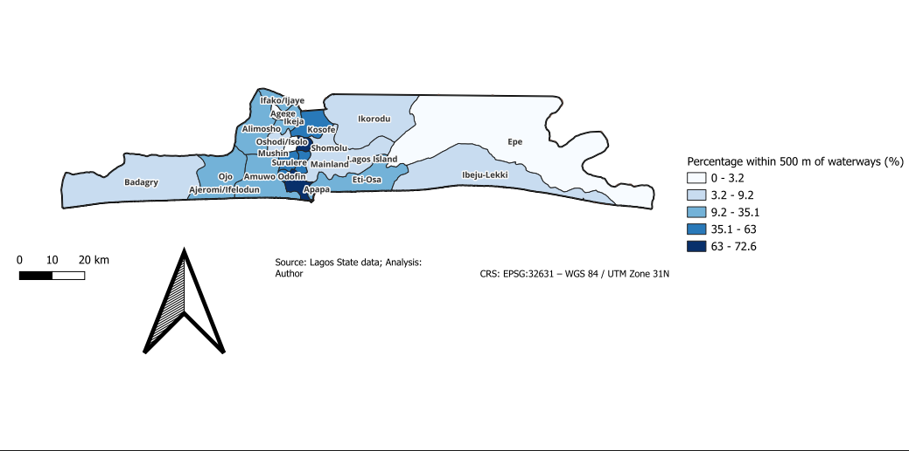

# GIS-Based Flood Risk Analysis of Lagos State, Nigeria

## Project Overview

This project presents a GIS-based spatial analysis of potential flood exposure across Local Government Areas (LGAs) in Lagos State, Nigeria.

The analysis uses **waterway proximity** as a spatial indicator for flood-risk assessment. A **500-metre buffer** was created around waterways and intersected with Lagos State LGA boundaries to determine the proportion of each LGA located within 500 metres of a waterway.

The analysis was conducted using **QGIS** and projected coordinate data suitable for accurate distance and area calculations.

## Objectives

- Identify areas of Lagos State located within 500 metres of waterways.
- Calculate the area of each LGA within the 500-metre waterway buffer.
- Calculate the percentage of each LGA located within the buffer.
- Visualize the spatial distribution of waterway proximity across Lagos State.
- Demonstrate the application of GIS and spatial analysis to flood-risk assessment.

## Methodology

The analysis followed these major steps:

1. Prepared Lagos State LGA boundary data.
2. Prepared and clipped waterway data.
3. Created a **500 m buffer** around waterways.
4. Reprojected the data to **EPSG:32631 (WGS 84 / UTM Zone 31N)**.
5. Intersected the LGA boundaries with the waterway buffer.
6. Calculated the area of the intersected regions.
7. Summarized the buffered area by LGA.
8. Calculated the percentage of each LGA within the 500 m buffer.
9. Joined the results back to the LGA layer.
10. Produced a graduated choropleth map to visualize the results.

## Key Output

The main output is a choropleth map showing the percentage of each Lagos State LGA located within 500 metres of waterways.

A higher percentage represents a greater proportion of an LGA falling within the defined waterway-proximity zone.

This indicator can contribute to broader flood-risk analysis when combined with other factors such as:

- Elevation and topography
- Drainage capacity
- Rainfall
- Land use and land cover
- Soil characteristics
- Historical flood events
- Population and infrastructure exposure
- Social and economic vulnerability

## Final Map

The final map shows the percentage of each Lagos State LGA located within 500 metres of waterways.



**Map title:** Percentage of Lagos LGAs Within 500 m of Waterways  
**CRS:** EPSG:32631 — WGS 84 / UTM Zone 31N

## Project Structure

```text
Lagos-flood-risk-analysis/
│
├── data/
│   ├── Lagos_LGAs_32631.gpkg
│   ├── Lagos_Waterways_Clipped_UTM31.gpkg
│   └── lagos_flood_zone_buffer_metres.gpkg
│
├── maps/
│   └── Lagos LGA Waterway Map.pdf
│
├── outputs/
│   └── Lagos_LGAs_32631.gpkg
│
├── qgis/
│   └── Lagos_Flood_Risk_Analysis_Clean.qgz
│
└── README.md
s

